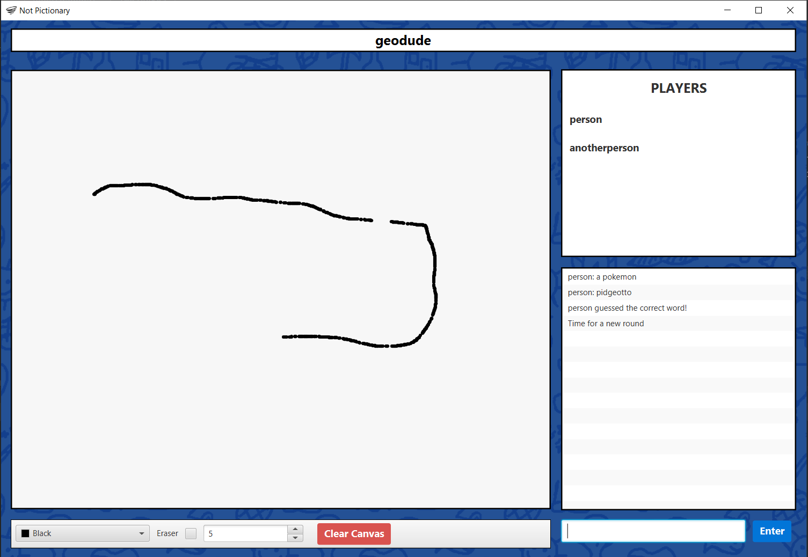
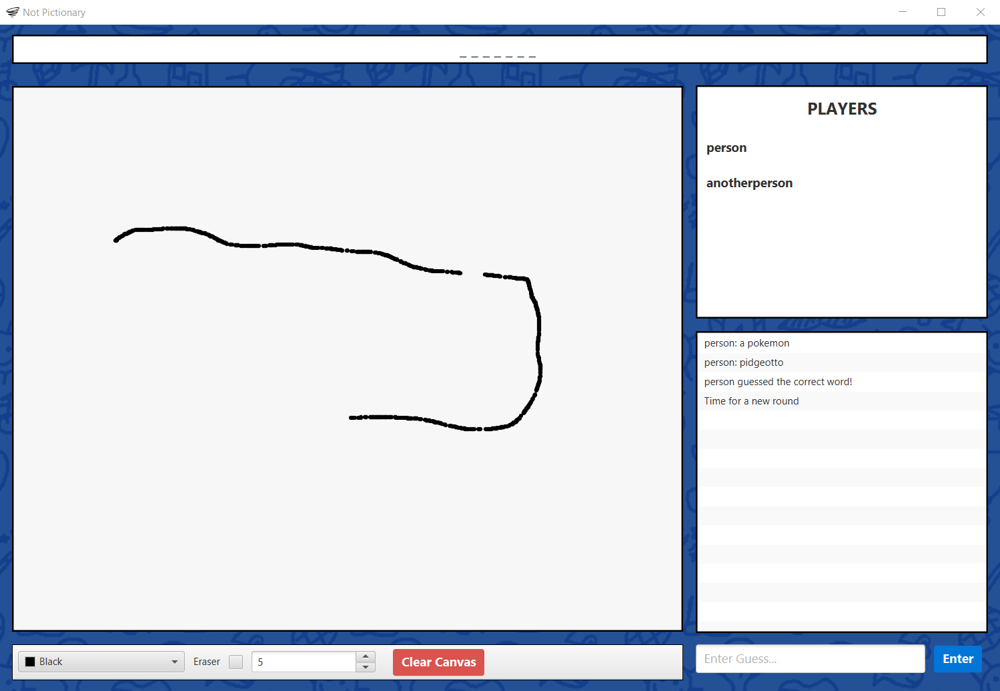

| Group Member      | Username      | SID       |
| :---------------- | :-----------: | --------: |
| Justin Katerberg  | jkaterberg    | 100750264 |
| Daniel Earley     | daniel-earley | 100744960 |
| Deval Panchal     | DevalPanchal  | 100744653 |
| Justin Wong       | SJustinWong   | 100743573 |

# Not-Pictionary
A simple multiplayer pictionary game (despite the name). Follows the standard pictionary game loop, one player is selected to draw an image from a random word. The image is streamed to all other players, who are able to make guesses about the original word. Once the word is guessed, the next player is given a word to draw and the loop repeats.

## Implementation
The frontend application was developed using Java, FXML, and CSS which produced a visually appealling application during run-time. During the initial phase of this project a 
wireframe was produced to grasp a better understanding of the UI and where everything would fall into place. 
The backend portion of this application was developed using Java.

## Sample Gameplay
This is an example output of the application running on the drawer's side:

This is an example output of the application running on the guesser's side:

The drawings and chat menu are broadcasted to each user in real-time.

## Running
Tested with Gradle 6.8.3, Java 15.0.2 and JavaFX 15

- **Clone the repository:** `git clone https://github.com/jkaterberg/not-pictionary.git`
- **Enter the repository Directory:** `cd not-pictionary`
- **Start the Server:** `gradle server`
- **Start the Client:** `gradle run`

## Technologies Used

- Java
- JavaFX
- Gradle
- FXML
- CSS
